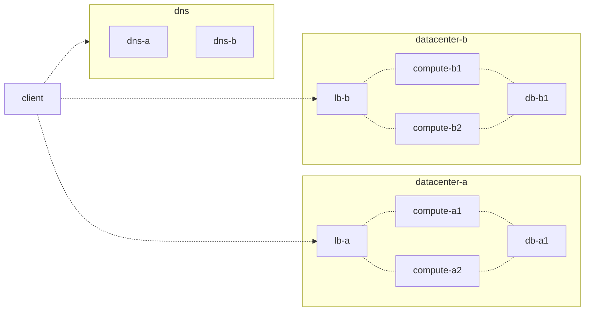

# Overview

Overall scheme is simple:

```mermaid
graph LR
  subgraph dns
    dns-a
    dns-b
  end

  subgraph datacenter-a
    lb-a -.- compute-a1 & compute-a2
    compute-a1 & compute-a2 -.- db-a1
  end

  subgraph datacenter-b
    lb-b -.- compute-b1 & compute-b2
    compute-b1 & compute-b2 -.- db-b1
  end

client -.-> dns
client -..-> lb-a & lb-b
```

Loadbalancers, compute resources and databases are managed mostly as Kubernetes resources.

Cloud services (e.g. managed database) may also be used.
